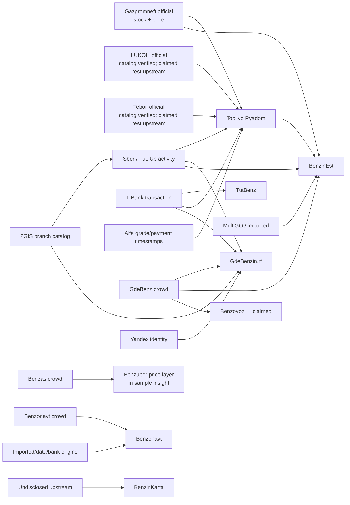

# SPB Fuel Intelligence — карта происхождения данных

Снимок: 11 сентября 2026 года. Карта отделяет **транспортный источник** (откуда скачан JSON) от **первичного наблюдения** (кто реально видел остаток, платёж или сообщение водителя). Пять API, повторивших один факт Sber/T-Bank, дают один provenance cluster, а не пять голосов.

## Наблюдаемые зависимости



Стрелка означает наблюдаемую или самим интерфейсом заявленную зависимость. Для Toplivo Ryadom официальным detail cross-check подтверждён слой Gazpromneft. Заявления о direct-rest LUKOIL/Teboil не удалось независимо подтвердить их официальными интерфейсами, поэтому они остаются `claimed_upstream`, а не новым официальным фактом.

## Provenance clusters для MVP

| Cluster | Первичный факт | Возможные транспорты | Что разрешено заключить | Что запрещено заключить |
|---|---|---|---|---|
| `gpn-official-stock` | `rest.avail` конкретной марки на станции | Gazpromneft, повтор в Toplivo Ryadom/BenzinEst | Текущий Y/N по известной марке с возрастом | Считать повторы агрегаторов независимыми голосами |
| `sber-fuelup-activity` | Sber/FuelUp per-grade inference/last fueling | Sber, Toplivo Ryadom, GdeBenzin.rf, BenzinEst | Grade status ровно в рамках исходной семантики и freshness | Повышать confidence из-за четырёх копий одного upstream |
| `tbank-station-payment` | Транзакция на станции, SKU часто неизвестен | TutBenz, Toplivo Ryadom, GdeBenzin.rf | `LIKELY` для станции/времени; вспомогательный сигнал | `AVAILABLE` для АИ-92/95/98/100/ДТ без товарной позиции |
| `alfa-grade-payment` | В Toplivo наблюдались timestamp по конкретной марке | Toplivo Ryadom | Grade-specific hint, пока не проверен первичный Alfa API | Называть его независимым официальным API Alfa |
| `gdebenz-crowd` | Отчёт пользователя с маркой, статусом и временем | GdeBenz, GdeBenzin.rf, BenzinEst, заявлено Benzovoz | Crowd Y/N/Q/L с возрастом и числом подтверждений | Считать републикации новыми очевидцами |
| `benzas-crowd` | Собственный crowd status/comment | Benzas | Отдельный crowd vote; price provenance хранить отдельно | Считать цену Benzuber подтверждением stock |
| `benzonavt-crowd` | Crowd report/конфликт | Benzonavt | Отдельный vote, если report origin = crowd и известен timestamp | Делать independent весь агрегированный station status |
| `network-catalog` | Штатный ассортимент/цена | LUKOIL, Teboil, Rosneft, Tatneft, Kirishi | Станция продаёт эту марку в принципе; цена может быть свежей | «Топливо есть сейчас» |
| `benzinkarta-undisclosed` | Full revealed status с нераскрытым upstream | BenzinKarta | Показывать как отдельный dependent/unknown-provenance hint | Использовать как независимое corroboration |
| `identity-2gis-osm-official` | Station identity/координаты | 2GIS/Sber IDs, OSM/GdeBenz IDs, IDs сетей | Построение canonical candidates | Считать совпадение координат доказательством одной АЗС без ID/бренд-проверки |

## Минимальная модель evidence

Каждая нормализованная запись должна хранить не только итоговый status:

```text
canonical_station_id (пока nullable)
source_station_id
source_transport
upstream_cluster
fuel_grade
observation_kind = official_stock | crowd | grade_payment | station_payment | catalog | price
raw_status
normalized_status = AVAILABLE | NOT_AVAILABLE | LIKELY | QUEUE | LIMITED | CONFLICT | UNKNOWN
observed_at
captured_at
expires_at / freshness_policy
price
queue
limit
sale_mode
confidence_from_source
independent
raw_fixture_sha256
```

Именно поэтому fixture Benzas разделяет crowd-availability и цену с `price_source=benzuber`, а TutBenz/GdeBenzin не повышают generic bank payment выше `LIKELY`.

## Правила дедупликации и station identity

1. Сначала точное соответствие официального station ID или стабильного external ID.
2. Затем проверяем alias IDs: 2GIS branch ID, OSM ID, ID сети, ID агрегатора.
3. Только затем создаём candidate match по координатам, нормализованному адресу и бренду.
4. Расстояние само по себе никогда не объединяет станции: соседние стороны дороги и две сети могут находиться ближе 75 метров.
5. У evidence дедупликация идёт по `upstream_cluster + station + grade + observed_at/transaction_id`, а не по домену API.
6. `UNKNOWN` не становится `NOT_AVAILABLE`; просроченный факт становится `UNKNOWN`.
7. `CATALOG_FUEL`, price update, working station, active pump/nozzle и generic payment — разные виды фактов.

## Что считать независимым сейчас

- **Прямой официальный stock:** Gazpromneft.
- **Известный, но смешанный upstream:** Sber/FuelUp; хранить 2GIS catalog отдельно от dynamic inference.
- **Самостоятельный crowd:** первичные отчёты GdeBenz и Benzas; Benzonavt — только отдельные rows с ясным crowd origin.
- **Зависимые представления:** BenzinEst, GdeBenzin.rf, Toplivo Ryadom, значительная часть TutBenz/Benzonavt, BenzinKarta с нераскрытым upstream, заявленный Benzovoz.
- **Только каталог:** LUKOIL, Teboil, Rosneft/PTK, Tatneft, Kirishiavtoservis, Yandex/2GIS controls.

Эта карта — результат Phase 0, не реализация Evidence Engine. Весовые коэффициенты и пользовательский итоговый статус сознательно оставлены для следующей фазы.


## Источники, добавленные после Phase 0

| Cluster | Первичный факт | Транспорт | Независимость | Что запрещено заключить |
|---|---|---|---|---|
| `gazpromneft-official` | `rest.avail` по марке на конкретной АЗС | прямой `gpnbonus.ru` **или** ретранслятор `tboo.ru/gpn` | да, но прямое чтение и ретрансляция — **один** кластер | Считать ретранслятор и оригинал двумя независимыми подтверждениями |
| `gdezapravka-crowd` | сообщения водителей своего сообщества поверх базы OSM | `gdezapravka.ru` | да, отдельное сообщество | Считать отсутствие марки в `available_fuels` подтверждённым отсутствием: это мягкий отрицательный признак |
| `telegram-benzinspb78` | подтверждения водителей из чата канала | публичное веб-превью `t.me/s/benzinspb78` | да, отдельное сообщество | Ждать от канала отрицательных сигналов: он публикует только наличие |
| `tofuel-mixed-upstream` | собственные голоса, смешанные с тремя нераскрытыми провайдерами | `tofuel.ru` | нет | Считать его голосом, независимым от банковских лент |
| `tatneft-official`, `rosneft-official`, `teboil-official`, `kirishi-official`, `lukoil-official` | штатный ассортимент и цены сети | официальные API и встроенный в HTML JSON | да как каталог | Выводить из каталога текущий остаток |

Ретрансляция официальной ленты — отдельный вид свидетельства `official_relay`: содержание официальное, доставка нет. Он отвечает так же, как прямое чтение, но всегда называет себя в объяснении и получает оценку достоверности не выше 90.
